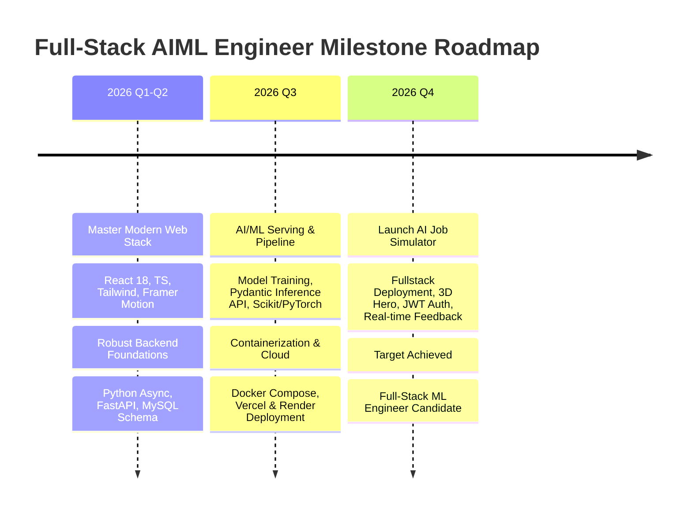

# 🚀 Full-Stack AI/ML Engineer Workspace & Roadmap (Stage 1)

> **Target Goal:** Full-Stack ML Engineer by **November 2026**  
> **Daily Commitment:** DSA (45-60 min) | Web Dev & ML Engineering (2-3 hrs)

---

## 📌 Stage 1 Roadmap Visual Dashboard

| # | Module Directory | Focus Area | Starter Code / Artifact | Status |
|---|------------------|------------|-------------------------|--------|
| 01 | `01_JavaScript_Fundamentals` | ES6+, Async/Await, Array Methods | `core_mechanics.js` | ⏳ Pending |
| 02 | `02_React_Core` | Hooks, State, Props, Forms | `cheatsheet.md` | ⏳ Pending |
| 03 | `03_TypeScript` | Interfaces, Generics, API Typing | `types_starter.ts` | ⏳ Pending |
| 04 | `04_SQL_and_MySQL` | DDL Schema, Foreign Keys, Indexes | `schema_design.sql` | ⏳ Pending |
| 05 | `05_Python_Backend_Basics` | Pydantic v2, Async, Exception Handling | `api_basics.py` | ⏳ Pending |
| 06 | `06_FastAPI_Core` | Routers, Dependency Injection, CORS, `/predict` | `main.py` | ⏳ Pending |
| 07 | `07_Fullstack_Integration` | Axios, Error Boundaries, Skeletons | `integration_checklist.md` | ⏳ Pending |
| 08 | `08_Tailwind_CSS` | Glassmorphism, Design Tokens, Palettes | `theme_config_guide.md` | ⏳ Pending |
| 09 | `09_Motion_Framer_Motion` | Page Transitions, Card Stagger, Progress Fill | `animation_variants.ts` | ⏳ Pending |
| 10 | `10_React_Three_Fiber` | R3F 3D Badge Canvas, Lights, OrbitControls | `HeroCanvas.tsx` | ⏳ Pending |
| 11 | `11_Auth_and_State_Management` | JWT Auth Flow, Zustand Store, Protected Routes | `auth_flow.md` | ⏳ Pending |
| 12 | `12_Git_and_GitHub` | Branching Strategy, Git Hygiene | `.gitignore` | ⏳ Pending |
| 13 | `13_Docker_Containerization` | Multi-stage Dockerfiles, Docker Compose | `docker-compose.yml` | ⏳ Pending |
| 14 | `14_Production_Deployment` | Vercel (FE) + Render/Railway (BE) + RDS | `deploy_notes.md` | ⏳ Pending |
| 15 | `15_AI_Job_Simulator` | Flagship App (Frontend, Backend, ML Engine) | `README.md` | ⏳ Pending |
| 16 | `16_DSA_in_CPP` | Striver A2Z DSA Sheet Logging | `tracker.md` | ⏳ Pending |

---

## 🎯 Milestone Targets (Target: November 2026)



---

## 🏗️ Flagship Architecture: AI Job Simulator

```
+-----------------------------------------------------------------------+
|                              CLIENT SIDE                              |
|   React 18 + TypeScript + Tailwind CSS + Framer Motion + R3F (3D)    |
+----------------------------------+------------------------------------+
                                   | HTTP / REST (JWT Auth)
                                   v
+-----------------------------------------------------------------------+
|                             FASTAPI SERVER                            |
|  - Middleware (CORS, Rate Limit)    - APIRouter (/auth, /simulate)    |
|  - Dependency Injection (DB, Model) - Pydantic Request Validation     |
+------------------+--------------------------------+-------------------+
                   |                                |
                   v                                v
+----------------------------------+ +----------------------------------+
|          MYSQL DATABASE          | |            ML ENGINE             |
| - Users & Submissions            | | - Scikit-learn / PyTorch Model  |
| - Simulation Scenarios           | | - Scaler & Preprocessing        |
| - Salary Prediction Logs         | | - Real-time Inference Pipeline  |
+----------------------------------+ +----------------------------------+
```

---

## 📅 Daily Routine Tracker

```
+--------------------------------------------------------------------+
| ⏰ 07:00 - 08:00 AM | DSA Practice (C++ Striver A2Z Sheet)           |
| ⏰ 08:00 - 10:30 PM | Full-Stack Dev & ML Engineering Deep Work     |
| ⏰ 10:30 - 11:00 PM | GitHub Commit, Progress Log & Review          |
+--------------------------------------------------------------------+
```
